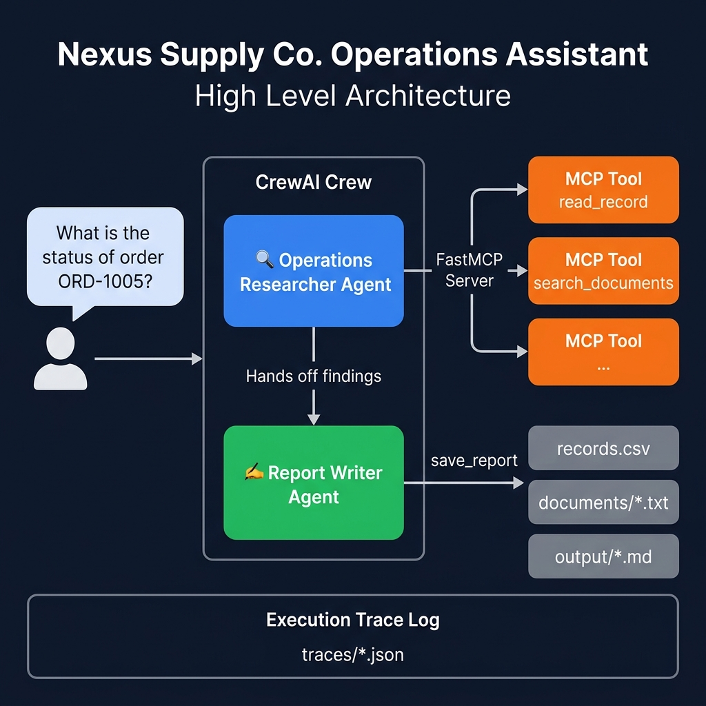

<div align="center">

# 🏭 Nexus Supply Co. — Operations Assistant

### A dual-agent AI system that answers business questions by searching internal policy documents and live order records — powered entirely by a local LLM on your machine.

<br/>


<br/>

</div>

---

## 💡 What It Does

Given a plain-English question like:

> *"What is the status of order ORD-1005 and what is our return policy for damaged items?"*

The system:

1. Parses the question to identify order IDs, status keywords, and topic areas
2. Dispatches a **Researcher agent** to call the right MCP tools in the right order
3. Hands findings to a **Writer agent** that produces a cited markdown report
4. Saves the report to `output/` and a full execution trace to `traces/`

Every fact in every report is cited. If a tool finds nothing, the system says so — it **never guesses**.

---

## 🏗️ Architecture



> For the detailed internal component flow, see [`low_level_diagram.png`](./low_level_diagram.png)


---

## 🛠️ Tech Stack

| Layer | Technology |
|---|---|
| Agent framework | [CrewAI](https://www.crewai.com/) |
| Tool protocol | [MCP](https://modelcontextprotocol.io/) via FastMCP |
| LLM | [Ollama](https://ollama.com/) — local `qwen2.5` |
| Testing | [Pytest](https://pytest.org/) |
| Language | Python 3.11+ |

---

## 🔧 MCP Tools

Four tools live in `server.py`. Each agent only gets the tools it needs — the Researcher cannot save reports, and the Writer cannot search.

| Tool | Agent | What it does |
|---|---|---|
| `read_record(order_id)` | Researcher | Looks up one order by ID from `records.csv` |
| `search_orders(query)` | Researcher | Searches `records.csv` by status, customer, or product |
| `search_documents(query)` | Researcher | Full-text searches all `.txt` policy files in `documents/` |
| `save_report(title, content)` | Writer | Timestamps and saves a markdown report to `output/` |

---

## 📁 Project Structure

```
operations-assistant/
│
├── crew.py                        # Agents, tasks, crew — main entry point
├── server.py                      # FastMCP server with all 4 tools
│
├── data/
│   └── records.csv                # 20 sample orders (ORD-1001 to ORD-1020)
│
├── documents/                     # 10 internal policy and support documents
│   ├── company_overview.txt
│   ├── return_policy.txt
│   ├── shipping_policy.txt
│   ├── payment_terms.txt
│   ├── warehouse_guidelines.txt
│   ├── vendor_policy.txt
│   ├── product_catalog.txt
│   └── support_ticket_001/002/003.txt
│
├── tests/
│   ├── test_tools.py              # 22 unit tests for all MCP tools
│   └── test_server.py             # Integration-level server tests
│
├── output/                        # Auto-generated reports (git-ignored)
├── traces/                        # Execution trace JSON logs (git-ignored)
│
├── high_level_diagram.png
├── low_level_diagram.png
├── DECISION_LOG.md
├── requirements.txt
├── .env.example
└── .gitignore
```

---

## 🚀 Getting Started

### Prerequisites

- Python 3.11+
- [Ollama](https://ollama.com/) installed and running locally

```powershell
ollama pull qwen2.5
```

### Install

```powershell
# Clone and enter the directory
cd operations-assistant

# Create and activate a virtual environment
python -m venv venv
.\venv\Scripts\activate

# Install dependencies
pip install -r requirements.txt

# Set up environment variables
copy .env.example .env
```

`.env` should contain:

```env
OLLAMA_BASE_URL=http://localhost:11434
MODEL_NAME=ollama/qwen2.5
```

### Run

```powershell
# Default question
python crew.py

# Custom questions
python crew.py "What is the status of order ORD-1005 and the return policy for damaged items?"
python crew.py "What is the shipping cost for orders under $200?"
python crew.py "What are the warehouse safety rules and which orders are processing?"
```

---

## 🧪 Tests

28 tests across two files covering all tools, validation logic, and edge cases.

```powershell
python -m pytest tests/ -v
```

| File | Tests | Covers |
|---|---|---|
| `tests/test_tools.py` | 22 | All 4 MCP tools — valid inputs, bad inputs, edge cases |
| `tests/test_server.py` | 6 | Integration-level server tool execution |

---

## ⚙️ Engineering Challenges

The six most significant problems encountered during development and how they were solved:

| # | Problem | Root Cause | Fix |
|---|---|---|---|
| 1 | **Agent infinite loops** | Both agents had all tools — Researcher called `save_report`, Writer re-searched, crew looped | Strictly segregated tools at init: Researcher gets search tools only, Writer gets `save_report` only |
| 2 | **Tool over-execution & hallucination** | Agent looped on `search_documents` and invented order statuses from support ticket text | Built a Python pre-processor that generates a numbered tool plan and computes `max_iter` dynamically; added anti-hallucination rules to Writer prompt |
| 3 | **MCP stdio corruption** | `print()` in `server.py` polluted the JSON-RPC stdout stream and crashed tool parsing | Rerouted all server logs to `sys.stderr`, keeping stdout clean for MCP protocol traffic |
| 4 | **ReAct formatting failures** | Local `qwen2.5` couldn't reliably follow CrewAI's text-based `Thought: / Action: / Action Input:` format | Enabled `function_calling_llm` on both agents, switching to native JSON tool-call schemas |
| 5 | **Windows encoding crashes** | CrewAI's rich Unicode output caused `UnicodeEncodeError` on default Windows console | Added `sys.stdout.reconfigure(encoding='utf-8')` at script startup |
| 6 | **Subprocess Python mismatch** | `StdioServerParameters` with `command="python"` picked system Python — lacked `mcp` package | Replaced with `sys.executable` so subprocess always inherits the active virtual environment |

---

## 📋 Decision Log

All major architectural decisions — model selection, transport choice, agent role design, and what was rejected — are documented in [`DECISION_LOG.md`](./DECISION_LOG.md).

---

<div align="center">

Built as part of the **IIT Gandhinagar PG Diploma in AI/ML & Agentic AI Engineering** program · Week 14 Mini-Project

</div>